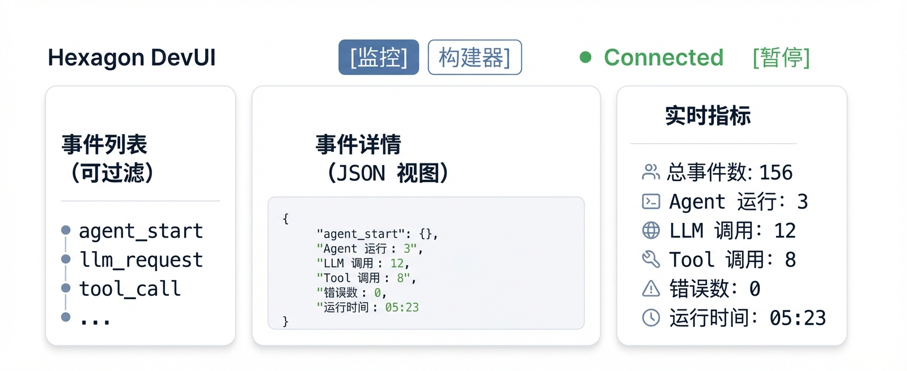
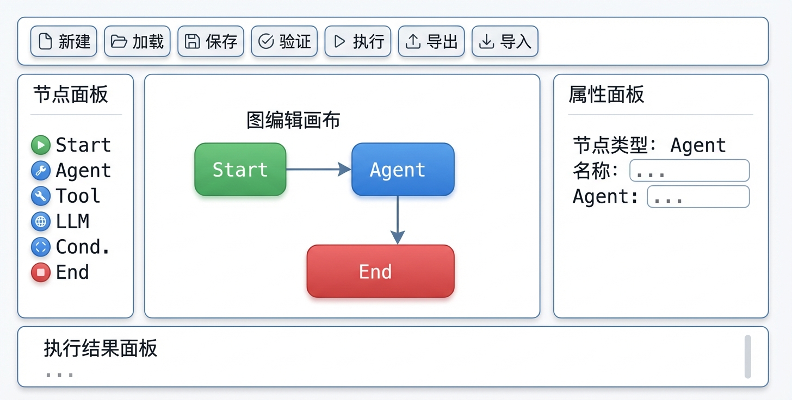

# Hexagon Dev UI

Hexagon AI Agent 框架的开发调试界面，提供实时事件监控、指标仪表板和可视化 Agent 工作流构建器。

## 功能特性

### 实时监控

- **实时事件流** - 通过 SSE 实时接收 Agent 执行事件，支持暂停/恢复
- **指标仪表板** - 实时展示运行指标（事件数、Agent 运行数、LLM 调用数等）
- **事件详情** - 查看事件的完整 JSON 数据，支持 trace 链路追踪
- **事件过滤** - 按类型过滤事件（Agent、LLM、Tool、Retriever、Graph、Error）
- **流式输出** - LLM 流式输出按 run_id 聚合实时显示

### 可视化 Agent 构建器

- **拖拽式编辑** - 从节点面板拖拽节点到画布，可视化构建 Agent 工作流
- **多种节点类型** - 支持 Start/End、Agent、Tool、LLM、Condition、Parallel 等节点
- **属性编辑** - 选中节点后实时编辑配置属性
- **图验证与执行** - 一键验证图结构、执行工作流并查看逐节点执行结果
- **保存与加载** - 将工作流保存到后端，支持 JSON 导入/导出

### 通用

- **双视图切换** - 在监控视图和构建器视图之间自由切换
- **暗色主题** - GitHub 风格的暗色界面，适合长时间使用
- **响应式布局** - 适配不同屏幕尺寸（1200px / 900px / 600px 断点）

## 界面预览

### 监控视图



### 构建器视图



## 技术栈

- **框架**: Vue 3.5 + Composition API
- **语言**: TypeScript 5.5 (严格模式)
- **构建**: Vite 5.4
- **图编辑**: Vue Flow（基于 Vue 3 的流程图库）
- **通信**: Server-Sent Events (SSE) + REST API

## 快速开始

### 安装依赖

```bash
npm install
```

### 开发模式

需要先启动 Hexagon DevUI 后端：

```bash
# 1. 启动后端
cd /path/to/hexagon
go run examples/devui/main.go

# 2. 启动前端开发服务器
cd /path/to/hexagon-ui
npm run dev
```

访问 http://localhost:5173

### 生产模式

```bash
# 构建
npm run build

# 复制到 hexagon 后端（嵌入到二进制文件中）
npm run copy
```

## 常用命令

```bash
npm run dev         # 启动开发服务器 (localhost:5173)
npm run build       # 类型检查 + 生产构建
npm run preview     # 预览构建产物
npm run typecheck   # 仅运行 TypeScript 类型检查
npm run copy        # 复制构建产物到 ../observe/devui/static/
```

## 事件类型

| 类型 | 事件 | 说明 |
|------|------|------|
| **Agent** | `agent_start`, `agent_end` | Agent 生命周期事件 |
| **LLM** | `llm_request`, `llm_stream`, `llm_response` | LLM 调用和流式输出 |
| **Tool** | `tool_call`, `tool_result` | 工具调用和返回结果 |
| **Retriever** | `retriever_start`, `retriever_end` | 检索器执行事件 |
| **Graph** | `graph_start`, `graph_node`, `graph_end` | 图执行流程事件 |
| **State** | `state_change` | 状态变更事件 |
| **Error** | `error` | 错误事件 |

## 构建器节点类型

| 节点 | 说明 |
|------|------|
| **Start** | 工作流入口节点 |
| **End** | 工作流出口节点 |
| **Agent** | 调用指定 Agent 执行任务 |
| **Tool** | 调用工具并获取结果 |
| **LLM** | 调用 LLM 提供商（配置 provider/model） |
| **Condition** | 条件分支，根据表达式选择执行路径 |
| **Parallel** | 并行执行多个子节点 |

## API 端点

前端通过以下端点与后端通信（开发模式下 Vite 代理到 `localhost:8080`）：

### 监控

| 端点 | 方法 | 说明 |
|------|------|------|
| `/events` | SSE | 事件流，推送实时事件 |
| `/api/metrics` | GET | 获取运行指标（每秒轮询） |

### 构建器

| 端点 | 方法 | 说明 |
|------|------|------|
| `/api/builder/graphs` | GET | 获取已保存的图列表 |
| `/api/builder/graphs` | POST | 创建新图 |
| `/api/builder/graphs/:id` | PUT | 更新图定义 |
| `/api/builder/graphs/:id` | DELETE | 删除图 |
| `/api/builder/graphs/:id/validate` | POST | 验证图结构 |
| `/api/builder/graphs/:id/execute` | POST | 执行图工作流 |
| `/api/builder/node-types` | GET | 获取可用节点类型定义 |

## 目录结构

```
hexagon-ui/
├── src/
│   ├── App.vue                      # 根组件（监控/构建器 Tab 切换）
│   ├── main.ts                      # 入口文件
│   ├── components/
│   │   ├── MonitorView.vue          # 监控视图（三栏布局）
│   │   └── builder/                 # 构建器组件
│   │       ├── BuilderView.vue      # 构建器主容器
│   │       ├── BuilderToolbar.vue   # 工具栏（新建/加载/保存/验证/执行）
│   │       ├── GraphCanvas.vue      # Vue Flow 图编辑画布
│   │       ├── NodePalette.vue      # 可拖拽节点面板
│   │       ├── PropertiesPanel.vue  # 节点属性编辑面板
│   │       ├── ExecutionPanel.vue   # 执行结果展示面板
│   │       ├── GraphListDialog.vue  # 图列表加载对话框
│   │       └── nodes/              # 自定义节点组件
│   │           ├── StartEndNode.vue
│   │           ├── AgentNode.vue
│   │           ├── ToolNode.vue
│   │           ├── LLMNode.vue
│   │           └── ConditionNode.vue
│   ├── composables/
│   │   ├── useSSE.ts                # SSE 连接管理（自动重连、事件缓冲）
│   │   ├── useMetrics.ts            # 指标轮询和格式化
│   │   ├── useGraphStore.ts         # 图状态管理（节点、边、选中状态）
│   │   └── useBuilderApi.ts         # 构建器 REST API 封装
│   ├── types/
│   │   ├── event.ts                 # 事件和指标类型定义
│   │   └── builder.ts               # 图、节点、边、验证结果类型定义
│   └── styles/
│       └── main.css                 # 全局样式（暗色主题）
├── vite.config.ts                   # Vite 配置（代理、路径别名）
└── tsconfig.json                    # TypeScript 配置
```

## 配置

### Vite 代理

开发模式下，Vite 将 API 请求代理到后端：

```ts
// vite.config.ts
proxy: {
  '/api': 'http://localhost:8080',
  '/events': 'http://localhost:8080'
}
```

如需连接其他后端地址，修改 `vite.config.ts` 中的代理目标。

### 运行参数

| 参数 | 值 | 说明 |
|------|------|------|
| 事件缓冲上限 | 1000 条 | 超出后自动丢弃旧事件 |
| SSE 重连间隔 | 3 秒 | 断开后自动重连 |
| 指标刷新间隔 | 1 秒 | 定时轮询后端指标 |

## 许可证

MIT
